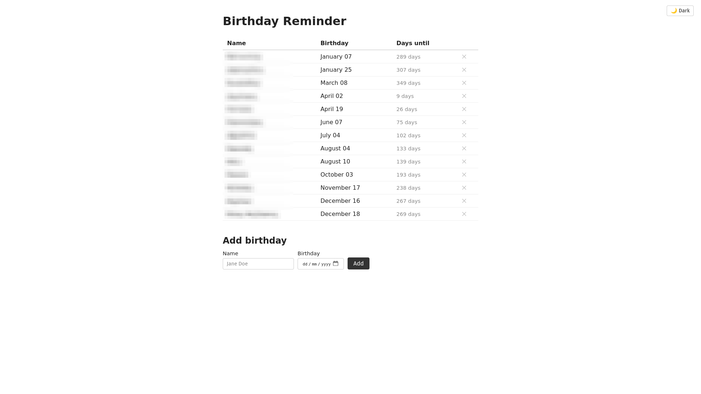

# Birthday Reminder

**Disclaimer: Claude was used for the development of this application!**

A serverless app that sends daily birthday notifications via [ntfy](https://ntfy.sh). It also notifies you 10 days before a birthday and includes Greek Orthodox name day reminders. Notifications are sent every day at 7:30 AM EST.

There is a web application that is used to create and delete birthday entries in the database.



## Prerequisites

- [Azure CLI](https://learn.microsoft.com/en-us/cli/azure/install-azure-cli)
- [Azure Functions Core Tools](https://learn.microsoft.com/en-us/azure/azure-functions/functions-run-local)
- Python 3.10+
- An active Azure subscription

## Deployment

### 1. Log in to Azure

```bash
az login
```

### 2. Run the deploy script

```bash
./deploy.sh --env <dev|prod> --location <azure-region>
```

Example:

```bash
./deploy.sh --env prod --location eastus
```

The script will:
1. Create a resource group
2. Deploy all Azure infrastructure via Bicep
3. Publish the function code
4. Generate a fresh ntfy topic and save it to `.ntfy_topic.tmp`
5. Write `web/.env` with the storage connection string

### 3. Subscribe to notifications

Open the ntfy topic URL printed at the end of the script in the [ntfy app](https://ntfy.sh) or browser to start receiving notifications.

### 4. Add birthdays via the web app

Start the web app locally.

```bash
./run_web.sh
```

Go to `localhost:8000` to create new birthday entries.

### Redeploying after code changes

```bash
func azure functionapp publish func-br-<env>-<location>
```

### Redeploying after infrastructure changes

```bash
az deployment group create \
  --resource-group rg-br-<env>-<location> \
  --template-file infra/main.bicep \
  --parameters env=<dev|prod> ntfyTopic=<topic>
```

## Azure Resources

- Azure Storage Account + `birthdays` table — stores birthday records
- Azure Function App on Flex Consumption plan
- App Service Plan (FC1)
- User-assigned Managed Identity

## Local Development

### Function app

```bash
pip install -r requirements.txt
func start
```

Environment variables are configured in `local.settings.json` (gitignored). Required keys:

| Key | Description |
|-----|-------------|
| `STORAGE_CONNECTION_STRING` | Azure Table Storage connection string |
| `NTFY_TOPIC` | ntfy topic name |
| `UPCOMING_REMINDER_DAYS` | Days in advance to send upcoming birthday reminders |

### Web app

The web app connects to the Azure Storage Account to insert or delete birthday entries. It runs locally.

```bash
./run_web.sh
```

Open [http://localhost:8000](http://localhost:8000). The web app reads `web/.env` automatically (created by the deploy script, or fill in manually from `web/.env.example`).

## Resource naming

| Resource | Pattern |
|----------|---------|
| Resource group | `rg-br-<env>-<location>` |
| Function App | `func-br-<env>-<location>` |
| App Service Plan | `asp-br-<env>-<location>` |
| Storage Account | `stbr<env><location><4-char suffix>` |
| Managed Identity | `id-br-<env>-<location>-01` |
